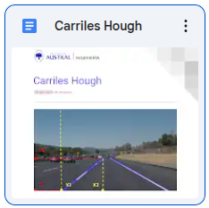

# Detección de carriles con Fast Line Detector y clasificación con Hough

[Repositorio en GitHub](https://github.com/Laboratorio-de-Robotica/Carriles-FLD-Hough-BFMC)

[Video demo](https://drive.google.com/file/d/1K8u8Ec_z8S3TaQzb88h5Vym0D-rSOVIx/view)

El documento [Carriles Hough](https://docs.google.com/document/d/1SYC7nZT3Y_Wc-rTGiAnix9lpgIxPOmTWTjAN7liq6cs/edit?usp=drive_link) brinda el fundamento teórico de este proyecto.

## Instalación
Clonar el repositorio e instalar las dependencias, usualmente en un entorno virtual.

    git clone https://github.com/Laboratorio-de-Robotica/Carriles-FLD-Hough-BFMC

Opcionalmente descargar el video [bfmc2020_online_2.avi](https://drive.google.com/file/d/10GSbrm0QxDPsdfeswEVYxFwTpjKVx5Vv/view?usp=drive_link) para facilitar la demo.

## Dependencias
El código fue probado con estas versiones de dependencias, pero debería funcionar sin problemas en versiones futuras.

- Python 3.12
- numpy 1.26.4
- python-opencv 4.10

## Demo
Ejecutar 

    python3 main.py

para usar el video por defecto bfmc2020_online_2.avi si se lo descargó previamente.

Para usar otros videos:

    python3 main.py -v nombre_del_video

## Guía de uso
El programa muestra 3 ventanas:

- hui, muestra el video y líneas que el usuario puede ajustar para configurar la homografía
- Main segments, el video en blanco y negro, y a color los segmentos detectados con FLD
- Zenithal view, la vista de vuelo de pájaro obtenida con la homografía

Las ventanas pueden tener pequeñas diferencias entre las tres versiones.

### HUI

Tiene tres líneas horizonales llamadas:

- horizon
- limit
- top

que el usuario selecciona con su tecla (H, L o T) y ajusta haciendo clic donde se quiere colocar la línea.

Horizon representa el horizonte, su correcto posicionamiento produce una adecuada vista cenital.

Limit establece el límite de la vista cenital y del procesamiento de Fast Line Detector.  Limit debe estar siempre debajo de horizon.  Llevar el límite al horizonte significa pedir una vista cenital infinita.

Top tiene un significado sutil.  Horizon determina la mayor parte de la homografía, excepto la relación de aspecto.  Top corrige la relación de aspecto.  Se debe ubicar para que el trapecio verde corresponda a la proyección de un cuadrado perfecto.

Con la tecla S se guardan estos ajustes en un archivo yaml con el mismo nombre que el video, de modo que se ajustan automáticamente cuando se vuelva a ejecutar sobre el mismo video.

### Main segments

Muestra los segmentos obtenidos por Fast Line Detector.  Se puede apreciar que no superan la altura establecida por limit.

Los segmentos se muestran en rojo, excepto los que se consideran principales (los que tienen una detección dominante) que se muestran en verde.

### Zenithal wide

La vista zenithal está dada por la homografía que se determina a partir de horizon y top.  Si las líneas de carriles rectos no se ven paralelas, hay que ajustar horizon.  Si las proporciones no son adecuadas (la imagen se ven alargada), hay que ajustar top.

Las diferentes versiones de carril.py tienen anotaciones ligeramente diferentes:

- abajo al medio una marcador rojo muestra el centro de la cámara
- abajo a la derecha se muestra el **mapa de Hough**
- en carril6.py el color de los segmentos representan su ángulo de orientación
- en carril.py abajo al medio un sistema de referencia representa la orientación general de la escena (sólo orientación, no posición)

Las siguientes imágenes muestran líneas de carriles paralelas gracias al correcto ajuste del horizonte:

La imagen cenital se produce por medio de una transformación geométrica de perspectiva exclusivamente a los efectos de la visualización.  Esta transformación consume recursos computacionales que conviene evitar en la computadora de abordo (Raspberry Pi).  El sistema no opera sobre la imagen cenital; la transformación de perspectiva de la imagen se puede omitir sin problemas.

### Mapa de Hough
Es un histrograma 2D que representa el mapa de votación de Hough: sus ejes son distancia del segmento al origne, y ángulo de orientación.  Sin embargo, por una cuestión de performance, no acumula píxeles sino segmentos.

El documento [Carriles Hough](https://docs.google.com/document/d/1SYC7nZT3Y_Wc-rTGiAnix9lpgIxPOmTWTjAN7liq6cs/edit?usp=drive_link) brinda el fundamento teórico de este proyecto, y particularmente del mapa de Hough.

## Videos desde el auto

La siguiente carpeta tiene varios videos proporcionados por Bosch, grabados en el evento BFMC:

[carpeta de videos](https://drive.google.com/drive/folders/19c24oCuQsnvKA2HSh8SWaYJuEkeUOhlY)

