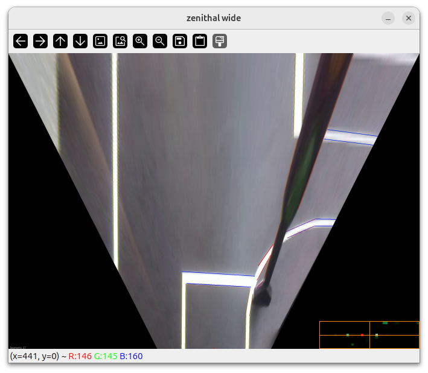

# Detector de carriles con FLD + espacios de Hough

Este proyecto es una prueba de concepto del uso de espacios de Hough para detectar carriles y otros elementos de interés en la pista de la competencia BFMC.

El proyecto consume un video grabado desde el auto, y produce una vista cenital y un espacio de Hough.  No incluye el análisis del espacio de Hough para reconocer las líneas de carriles.

[Video demo](https://drive.google.com/file/d/1K8u8Ec_z8S3TaQzb88h5Vym0D-rSOVIx/view)

# Instalación

1. Requisitos: Python3 y Numpy
2. Clonar el repositorio
3. Descargar algún video grabado desde el auto y guardarlo en la carpeta recién clonada
4. Ejecutar `python3 carril.py -v nombre_del_video`

Para usar el video por defecto *bfmc2020_online_2.avi*, ejecutar simplemente: `python3 carril.py`

# Videos desde el auto

La siguiente carpeta tiene varios videos proporcionados por Bosch, grabados en el evento BFMC:

[carpeta de videos](https://drive.google.com/drive/folders/19c24oCuQsnvKA2HSh8SWaYJuEkeUOhlY)

Para probar conviene descargar directamente el video por defecto:
[bfmc2020_online_2.avi](https://drive.google.com/file/d/10GSbrm0QxDPsdfeswEVYxFwTpjKVx5Vv/view?usp=drive_link)

# Módulos

- HUI.py: interfaz de usuario para determinar la homografía y el tamaño de la vista cenital
- detector.py: contiene las siguientes clases
  - Segments: contiene segmentos y propiedades computadas como Hough
  - SegmentsAnnotator
  - Bins
  - HoughSpace

`carril.py` es un ejemplo de uso de estas bibliotecas.

El documento [Carriles Hough](https://docs.google.com/document/d/1SYC7nZT3Y_Wc-rTGiAnix9lpgIxPOmTWTjAN7liq6cs/edit?usp=drive_link) brinda el fundamento teórico de este proyecto.